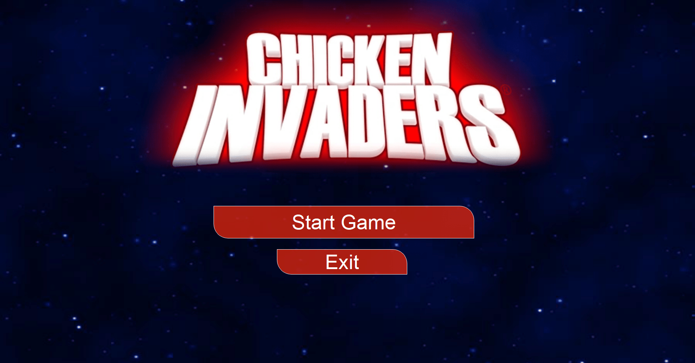
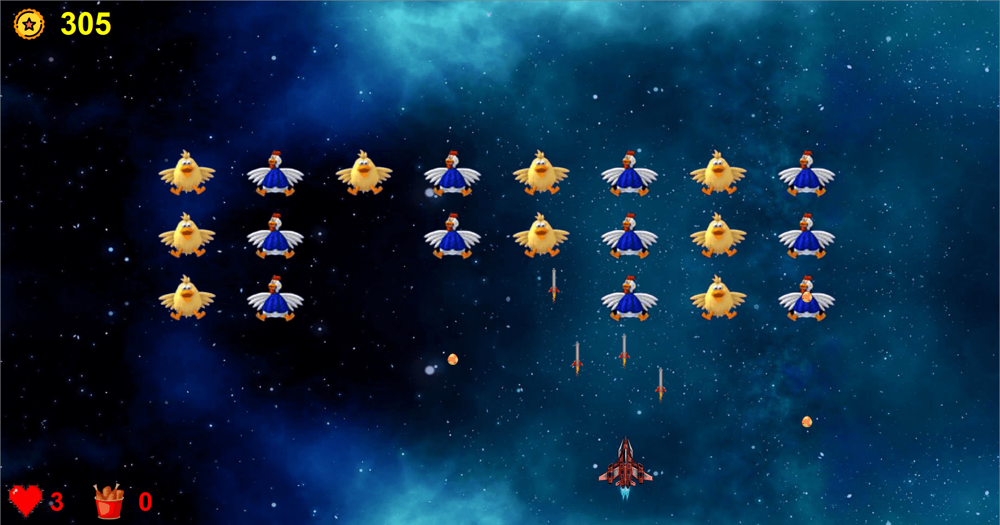
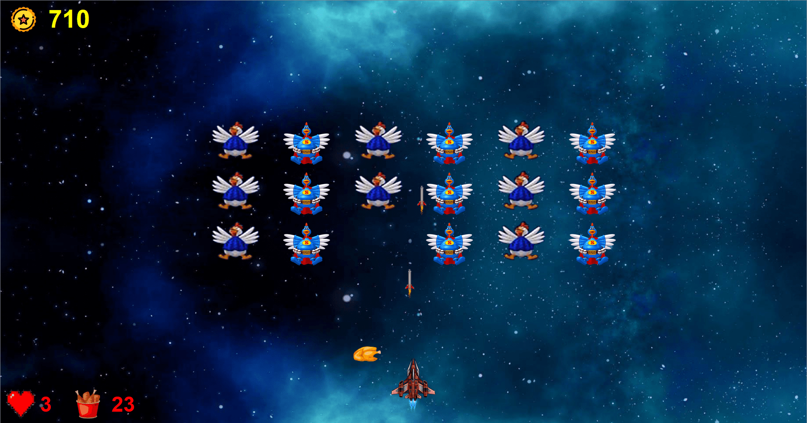
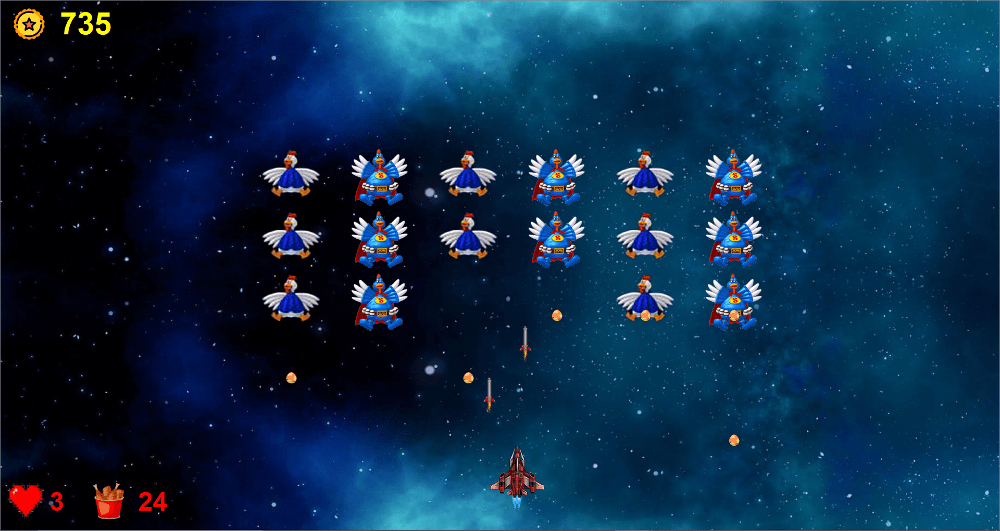
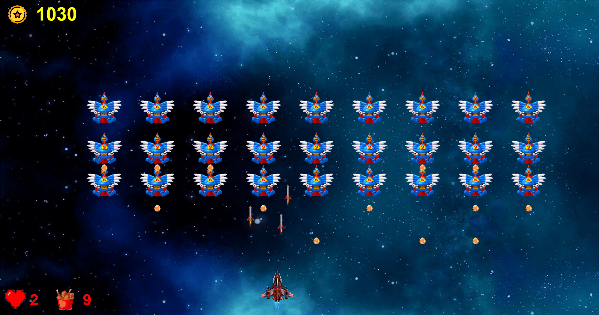

# 🐔 Chicken Invaders Clone (C++/Qt)

This project is a detailed and feature-rich clone of the classic arcade shooter, "Chicken Invaders," developed from the ground up using C++ and the Qt framework. It was created as a collaborative university project to demonstrate advanced object-oriented programming, game logic implementation, and graphical user interface design.

## Screenshots

Below are some screenshots showcasing the game:

| Start Menu | Gameplay 1 |
|------------|------------|
|  |  |

| Gameplay 2 | Gameplay 3 | Gameplay 4 |
|------------|------------|------------|
|  |  |  |

---

## ✨ Key Features

- **3 Unique Chapters:** The game progresses through three chapters, each with two stages of increasing difficulty.
- **Diverse Enemies:** Battle against a variety of enemies including Chickens, Hens, and powerful Super Hens.
- **Engaging Mechanics:** Dodge eggs, collect meat for score bonuses, and grab power-ups to enhance your spaceship's firepower.
- **Dynamic Level Design:** Face carefully designed enemy formations that change with each stage and chapter.
- **Core Gameplay:** Includes essential features like a scoring system, life management (hearts), and pause/continue functionality (pressing `esc` key).

---

## Gameplay & Mechanics

### 🛸 The Spaceship

- **Movement:** Controlled via mouse movement.
- **Shooting:** Fire projectiles by clicking the mouse.

### 🥚 Enemies & Obstacles

- **Chicken:**
  - **Health:** 1 hit
  - **Score:** +5 points
  - **Behavior:** Appears in formation and moves downwards.

- **Hen (Chapter 2+):**
  - **Health:** 2 hits
  - **Score:** +10 points
  - **Behavior:** Can drop eggs. Drops one piece of meat upon death.

- **Super Hen (Chapter 3+):**
  - **Health:** 4 hits
  - **Score:** +20 points  
  - **Behavior:** A tougher version of the Hen.

- **Egg:**
  - **Behavior:** Dropped by Hens. If it hits the player, one life is lost. If it reaches the bottom of the screen, it turns into an omelet and disappears. Can be destroyed by player projectiles for +5 points.

### 🎁 Items & Power-ups

- **Meat:**
  - **Source:** Dropped by Hens and Super Hens.
  - **Function:** Collect 30 pieces of meat to receive a **+50 point bonus**. The meat counter then resets to zero.

- **Gift (Power-up):**
  - **Source:** Appears randomly in Chapter 3.
  - **Function:** Upgrades the spaceship's weapon to fire **two projectiles** simultaneously.

---

## 💻 Tech Stack

- **Language:** C++
- **Framework:** Qt (Version 5.13.2) (for GUI, game loop, and event handling)
- **IDE:** Qt Creator

---

## 🚀 How to Build and Run

1.  Make sure you have **Qt Creator** and the required C++ compiler toolchain installed.
2.  Clone this repository to your local machine.
3.  Open the `ChickenInvadersProject.pro` file in Qt Creator.
4.  Configure the project for your system's compiler.
5.  Build and run the project.

---

## 👥 Authors

This project was a collaborative effort by:
* **Mohammad Khajehnoori**
* **Nima Omidifar**